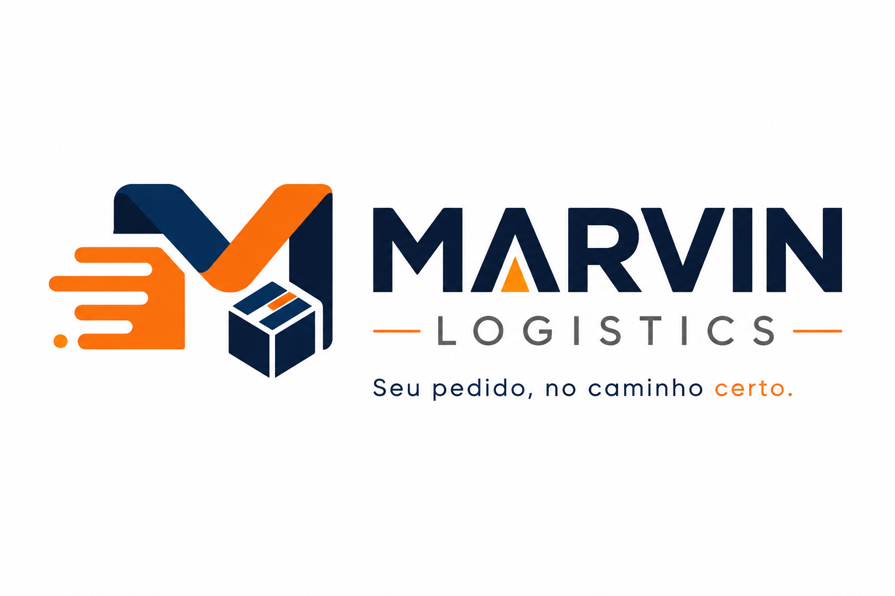
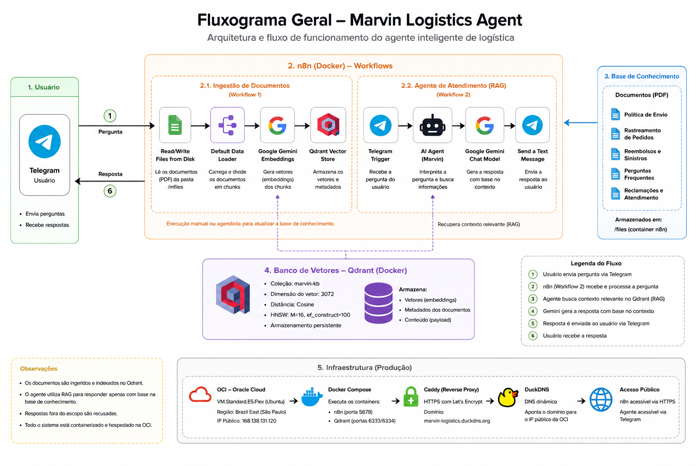
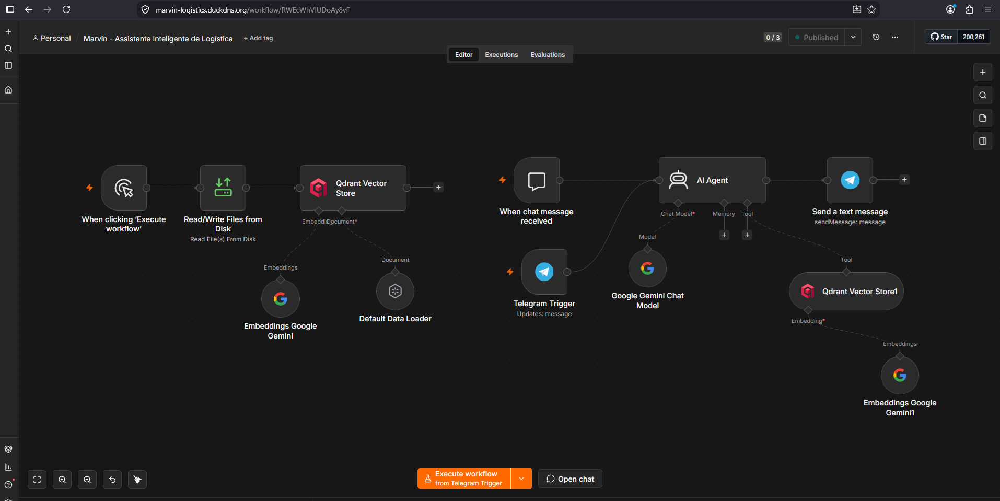
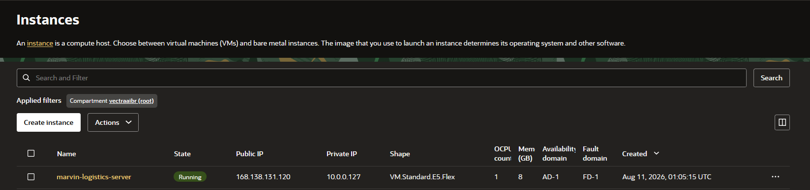
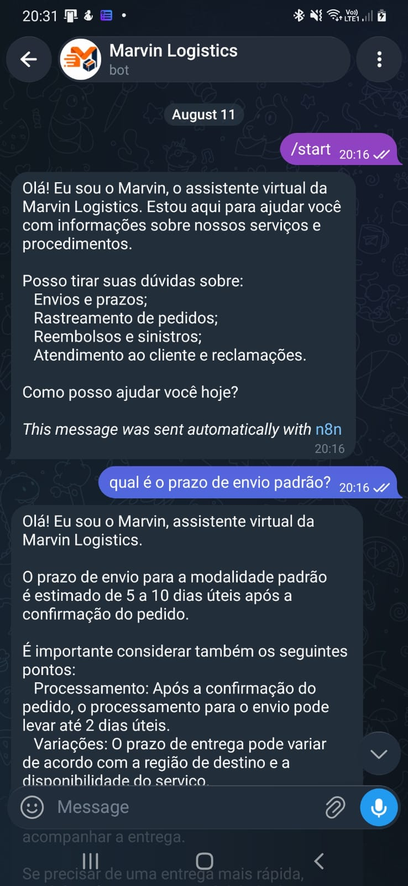
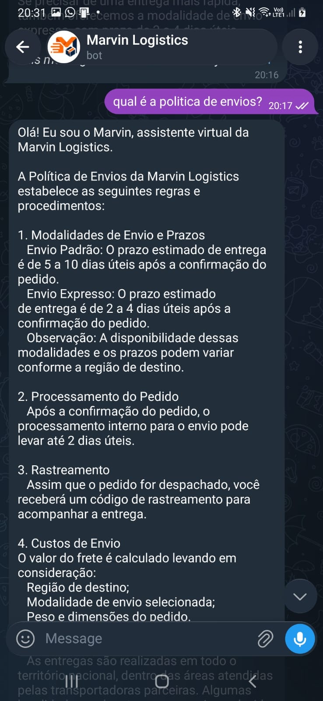
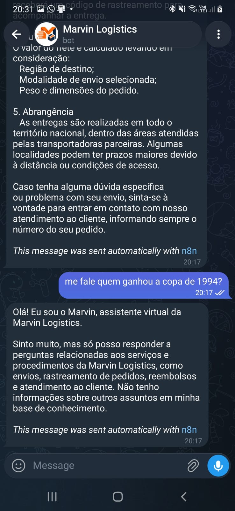

# Marvin Logistics Agent

<p align="center">
  
</p>

<p align="center">
  <strong>Assistente inteligente de logística baseado em RAG, integrado ao Telegram e implantado em Oracle Cloud Infrastructure.</strong>
</p>

<p align="center">
  
  
  
  
  
  
</p>

---

## Sobre o projeto

O **Marvin Logistics Agent** é um assistente virtual desenvolvido para responder dúvidas relacionadas aos serviços e procedimentos de uma empresa fictícia de logística.

A solução utiliza uma arquitetura de **Retrieval-Augmented Generation (RAG)** para recuperar informações de uma base de conhecimento documental e gerar respostas contextualizadas com apoio de Inteligência Artificial.

O agente é integrado ao **Telegram**, permitindo que o usuário interaja diretamente com o Marvin por meio de mensagens. As consultas são processadas pelo **n8n**, submetidas à recuperação semântica no banco vetorial **Qdrant** e respondidas com apoio do **Google Gemini**.

Para reduzir respostas não fundamentadas, o agente foi configurado para atuar dentro do domínio definido pela base de conhecimento. Quando uma solicitação está fora desse contexto, o Marvin informa que não possui aquela informação e apresenta os assuntos para os quais pode oferecer suporte.

---

## Objetivo

O projeto tem como objetivo demonstrar a implementação de um agente de IA capaz de:

* consultar documentos corporativos utilizando busca semântica;
* responder perguntas com base em uma base de conhecimento controlada;
* integrar modelos de linguagem e embeddings em uma arquitetura RAG;
* automatizar ingestão, recuperação e geração de respostas utilizando n8n;
* armazenar embeddings e recuperar contexto por meio do Qdrant;
* disponibilizar atendimento por meio do Telegram;
* executar os serviços de forma containerizada com Docker;
* disponibilizar a aplicação em ambiente de produção na Oracle Cloud Infrastructure;
* utilizar domínio público e comunicação HTTPS para integração segura com serviços externos.

---

## Principais funcionalidades

* Consulta de informações sobre **envios e prazos**;
* Orientações sobre **rastreamento de pedidos**;
* Informações sobre **reembolsos e sinistros**;
* Respostas para **perguntas frequentes**;
* Suporte relacionado a **reclamações e atendimento ao cliente**;
* Recuperação semântica de informações utilizando RAG;
* Respostas fundamentadas na base de conhecimento;
* Tratamento de perguntas fora do escopo;
* Integração automática com Telegram;
* Persistência da base vetorial com Qdrant;
* Deploy em ambiente cloud.

---

## Arquitetura da solução

A arquitetura do Marvin Logistics Agent está organizada em dois fluxos principais:

### 1. Ingestão da base de conhecimento

Os documentos em PDF são carregados pelo n8n, processados pelo Data Loader, convertidos em embeddings utilizando Google Gemini e armazenados no Qdrant.

### 2. Atendimento utilizando RAG

As mensagens recebidas pelo Telegram são encaminhadas ao AI Agent. O agente realiza a recuperação semântica no Qdrant, utiliza os trechos relevantes como contexto para o Google Gemini e envia a resposta gerada novamente ao usuário pelo Telegram.

<p align="center">
  
</p>

### Fluxo simplificado

```text
Usuário
   ↓
Telegram
   ↓
Telegram Trigger
   ↓
AI Agent
   ↓
Qdrant Vector Store
   ↓
Google Gemini
   ↓
Send a Text Message
   ↓
Telegram
   ↓
Usuário
```

A aplicação é executada em uma máquina virtual da **Oracle Cloud Infrastructure (OCI)**. O n8n e o Qdrant são executados em containers Docker, enquanto o **Caddy** atua como reverse proxy para disponibilização segura do serviço.

O domínio público é fornecido pelo **DuckDNS** e direcionado para a infraestrutura implantada na OCI.

```text
Internet
   ↓
marvin-logistics.duckdns.org
   ↓
HTTPS
   ↓
Caddy
   ↓
n8n
   ↓
Docker Network
   ↓
Qdrant
```

---

## Workflow em produção

O workflow principal reúne a ingestão da base de conhecimento e o atendimento do agente em uma única automação.

<p align="center">
  
</p>

O fluxo contempla:

* leitura dos documentos da base de conhecimento;
* geração de embeddings;
* armazenamento dos vetores no Qdrant;
* recebimento de mensagens pelo Telegram;
* recuperação de contexto relevante;
* geração de respostas com Google Gemini;
* envio automático da resposta ao usuário.

---

## Tecnologias utilizadas

| Tecnologia                      | Utilização no projeto                                           |
| ------------------------------- | --------------------------------------------------------------- |
| **n8n**                         | Orquestração dos workflows de ingestão e atendimento            |
| **Google Gemini**               | Modelo de linguagem utilizado pelo agente                       |
| **Gemini Embeddings**           | Geração das representações vetoriais dos documentos e consultas |
| **Qdrant**                      | Armazenamento e recuperação vetorial da base de conhecimento    |
| **Telegram Bot API**            | Interface de comunicação com o usuário                          |
| **Docker / Docker Compose**     | Containerização e execução dos serviços                         |
| **Oracle Cloud Infrastructure** | Hospedagem da aplicação em ambiente cloud                       |
| **Caddy**                       | Reverse proxy e disponibilização do serviço por HTTPS           |
| **DuckDNS**                     | Domínio público utilizado no ambiente de produção               |
| **Python**                      | Geração automatizada dos documentos PDF da base de conhecimento |

---

## Base de conhecimento

A base de conhecimento foi construída especificamente para representar procedimentos de uma empresa fictícia de logística.

Os documentos abrangem cinco áreas:

* **Envios** — modalidades, prazos, processamento, custos e abrangência;
* **Rastreamento** — acompanhamento e atualização dos pedidos;
* **Reembolsos e sinistros** — procedimentos relacionados a ocorrências e solicitações;
* **Perguntas frequentes** — dúvidas recorrentes dos clientes;
* **Reclamações e atendimento** — orientações relacionadas ao suporte ao cliente.

Os conteúdos são mantidos originalmente em arquivos Markdown:

```text
documentos/conhecimento/
├── envios.md
├── perguntas-frequentes.md
├── rastreamento.md
├── reclamacoes-atendimento.md
└── reembolsos-sinistros.md
```

Um script Python realiza a geração dos respectivos documentos PDF:

```bash
python scripts/gerar_pdfs.py
```

Os arquivos resultantes são armazenados em:

```text
documentos/pdf/
├── envios.pdf
├── perguntas-frequentes.pdf
├── rastreamento.pdf
├── reclamacoes-atendimento.pdf
└── reembolsos-sinistros.pdf
```

Esses documentos constituem a fonte utilizada no processo de ingestão da base vetorial.

---

## Como funciona o RAG

O projeto utiliza **Retrieval-Augmented Generation (RAG)** para combinar recuperação semântica de informações com geração de linguagem natural.

Durante a ingestão:

```text
Documentos PDF
      ↓
n8n
      ↓
Data Loader
      ↓
Gemini Embeddings
      ↓
Qdrant Vector Store
```

Durante uma consulta:

```text
Pergunta do usuário
      ↓
Telegram
      ↓
AI Agent
      ↓
Busca semântica no Qdrant
      ↓
Contexto recuperado
      ↓
Google Gemini
      ↓
Resposta
      ↓
Telegram
```

Dessa forma, o modelo utiliza informações recuperadas da documentação da Marvin Logistics como contexto para elaborar suas respostas.

---

## Estrutura do repositório

```text
marvin-logistics-agent/
│
├── capturas/
│   ├── evidencias/
│   │   ├── deploy-n8n-oci-dns.png
│   │   ├── deploy-oci.png
│   │   ├── fluxograma-geral.png
│   │   ├── https-duck-oci.png
│   │   ├── oci-config.png
│   │   └── workflow-oci-producao.png
│   │
│   ├── logo/
│   │   ├── marvin-icone.png
│   │   └── marvin-logo.png
│   │
│   └── testes/
│       ├── fora-contexto.jpeg
│       ├── politica-envios.jpeg
│       └── saudacao.jpeg
│
├── documentos/
│   ├── conhecimento/
│   │   ├── envios.md
│   │   ├── perguntas-frequentes.md
│   │   ├── rastreamento.md
│   │   ├── reclamacoes-atendimento.md
│   │   └── reembolsos-sinistros.md
│   │
│   └── pdf/
│       ├── envios.pdf
│       ├── perguntas-frequentes.pdf
│       ├── rastreamento.pdf
│       ├── reclamacoes-atendimento.pdf
│       └── reembolsos-sinistros.pdf
│
├── fluxos/
│   └── Marvin - Assistente Inteligente de Logística.json
│
├── scripts/
│   └── gerar_pdfs.py
│
├── .env.example
├── .gitignore
├── docker-compose.yml
├── docker-compose.production.yml
└── README.md
```

---

## Executando localmente

### Pré-requisitos

Para executar o projeto localmente, é necessário possuir:

* Docker;
* Docker Compose;
* uma chave de API do Google Gemini;
* uma conta e um bot configurado no Telegram.

### 1. Clone o repositório

```bash
git clone https://github.com/ldac42/marvin-logistics-agent.git
cd marvin-logistics-agent
```

### 2. Inicie os containers

```bash
docker compose up -d
```

A configuração local inicializa:

```text
marvin-n8n
marvin-qdrant
```

Para verificar o estado dos containers:

```bash
docker compose ps
```

### 3. Acesse o n8n

No ambiente local, o n8n é disponibilizado em:

```text
http://localhost:6678
```

### 4. Configure as credenciais

Dentro do n8n, configure as credenciais necessárias para:

* **Google Gemini**;
* **Telegram**;
* **Qdrant**.

As chaves e tokens de acesso não devem ser armazenados diretamente no repositório.

### 5. Importe o workflow

O workflow utilizado pelo projeto está disponível em:

```text
fluxos/Marvin - Assistente Inteligente de Logística.json
```

No n8n, utilize a opção de importação de workflow e selecione esse arquivo.

Após a importação, revise as credenciais associadas aos nodes antes da primeira execução.

### 6. Realize a ingestão dos documentos

Com os documentos disponíveis em `documentos/pdf/`, execute o fluxo de ingestão para gerar os embeddings e armazená-los no Qdrant.

Após a indexação, a base vetorial estará disponível para as consultas realizadas pelo agente.

> **Observação:** credenciais, tokens, chaves de API e demais informações sensíveis não fazem parte do repositório e devem ser configurados individualmente no ambiente de execução.

---

## Deploy em produção

O Marvin Logistics Agent foi implantado em uma máquina virtual na **Oracle Cloud Infrastructure (OCI)**, permitindo que o agente permaneça disponível independentemente do ambiente local de desenvolvimento.

O ambiente de produção utiliza:

* **Oracle Cloud Infrastructure** para hospedagem;
* **Docker Compose** para execução dos serviços;
* **n8n** para automação e orquestração;
* **Qdrant** como banco de dados vetorial;
* **Caddy** como reverse proxy;
* **DuckDNS** para resolução do domínio público;
* **HTTPS** para comunicação segura com serviços externos.

A configuração específica do ambiente de produção está versionada em:

```text
docker-compose.production.yml
```

No ambiente de produção, o Qdrant permanece restrito à rede interna dos containers, enquanto o acesso externo ao n8n é intermediado pelo Caddy.

### Infraestrutura na Oracle Cloud

<p align="center">
  
</p>

A aplicação utiliza domínio público configurado no DuckDNS e comunicação HTTPS, permitindo a integração do webhook do Telegram com o n8n no ambiente cloud.

---

## Integração com Telegram

O Telegram funciona como interface de comunicação entre o usuário e o Marvin Logistics Agent.

Quando uma mensagem é enviada ao bot:

1. o **Telegram Trigger** recebe a mensagem;
2. o conteúdo é encaminhado ao **AI Agent**;
3. o agente realiza a recuperação semântica na base vetorial;
4. os trechos relevantes armazenados no Qdrant são utilizados como contexto;
5. o Google Gemini gera a resposta;
6. o node **Send a Text Message** devolve a resposta ao usuário no Telegram.

Todo o processo ocorre automaticamente no ambiente de produção.

---

## Testes do agente

Foram realizados testes funcionais para validar diferentes comportamentos do Marvin Logistics Agent.

### 1. Inicialização e consulta objetiva

O primeiro teste verifica a inicialização do agente pelo comando `/start` e uma consulta relacionada aos prazos de envio.

<p align="center">
  
</p>

O agente apresenta seu escopo de atendimento e responde à consulta utilizando as informações disponíveis na base de conhecimento.

### 2. Recuperação de informações da base

O segundo teste utiliza uma pergunta mais ampla sobre a política de envios.

<p align="center">
  
</p>

Nesse cenário, o agente recupera informações relacionadas às modalidades de envio, prazos, processamento, rastreamento e demais regras presentes na documentação.

### 3. Validação de escopo

Também foi realizado um teste com uma pergunta completamente fora do domínio logístico.

<p align="center">
  
</p>

Em vez de utilizar o conhecimento geral do modelo para responder, o Marvin informa que a solicitação está fora de sua base de conhecimento e apresenta os assuntos para os quais pode oferecer suporte.

Esse comportamento contribui para reduzir respostas não fundamentadas e manter o agente alinhado ao contexto corporativo definido para o projeto.

---

## Evidências técnicas

Além das imagens apresentadas neste README, evidências complementares da implantação estão disponíveis em:

```text
capturas/evidencias/
```

A pasta reúne registros da infraestrutura na Oracle Cloud, configuração do domínio, acesso HTTPS, ambiente n8n em produção e workflow publicado.

---

## Segurança e boas práticas

Algumas medidas foram adotadas para evitar a exposição de informações sensíveis e reduzir a superfície pública da aplicação:

* credenciais e tokens não são versionados no Git;
* chaves de API são configuradas diretamente no ambiente de execução;
* o acesso externo ao n8n utiliza HTTPS;
* o Caddy atua como reverse proxy no ambiente de produção;
* o Qdrant de produção permanece restrito à comunicação interna entre os containers;
* volumes Docker garantem persistência dos dados;
* arquivos de backup locais não são incluídos no repositório.

> Nunca adicione tokens do Telegram, chaves de API do Gemini ou outras credenciais diretamente ao código-fonte ou aos arquivos versionados.

---

## Limitações

O Marvin Logistics Agent foi desenvolvido como projeto demonstrativo e possui algumas limitações conhecidas:

* a base de conhecimento está limitada aos documentos disponibilizados no projeto;
* o agente não realiza consultas a sistemas logísticos reais;
* informações de pedidos, clientes e rastreamentos reais não são processadas;
* alterações na documentação exigem nova ingestão para atualização da base vetorial;
* a qualidade das respostas depende da cobertura e da qualidade dos documentos indexados.

Essas limitações fazem parte do escopo definido para o projeto e permitem manter a solução simples, reproduzível e focada na demonstração da arquitetura RAG.

---

## Status do projeto

**Concluído — versão demonstrativa funcional.**

* [x] Base de conhecimento documental
* [x] Geração automatizada dos PDFs
* [x] Ingestão e indexação vetorial
* [x] Qdrant Vector Store
* [x] Gemini Embeddings
* [x] Google Gemini como LLM
* [x] Arquitetura RAG
* [x] Workflow automatizado no n8n
* [x] Integração com Telegram
* [x] Validação de perguntas fora do escopo
* [x] Containerização com Docker
* [x] Deploy na Oracle Cloud Infrastructure
* [x] Domínio público
* [x] HTTPS
* [x] Evidências de funcionamento

---

## Autor

**Lucas Duboc**

GitHub: [@ldac42](https://github.com/ldac42)

---

## Considerações finais

O Marvin Logistics Agent demonstra a construção de uma solução de Inteligência Artificial aplicada ao atendimento logístico, combinando **automação, modelos generativos, recuperação semântica e infraestrutura em nuvem**.

A utilização de RAG permite que o agente trabalhe sobre uma base de conhecimento controlada, enquanto a integração com Telegram oferece uma interface simples para interação com o usuário. A implantação em OCI, associada à containerização com Docker e ao acesso por HTTPS, permite que a solução funcione independentemente do ambiente local utilizado durante o desenvolvimento.

O projeto consolida, em uma única aplicação, conceitos de **IA generativa, embeddings, bancos vetoriais, automação de workflows, APIs, containers e cloud computing**.